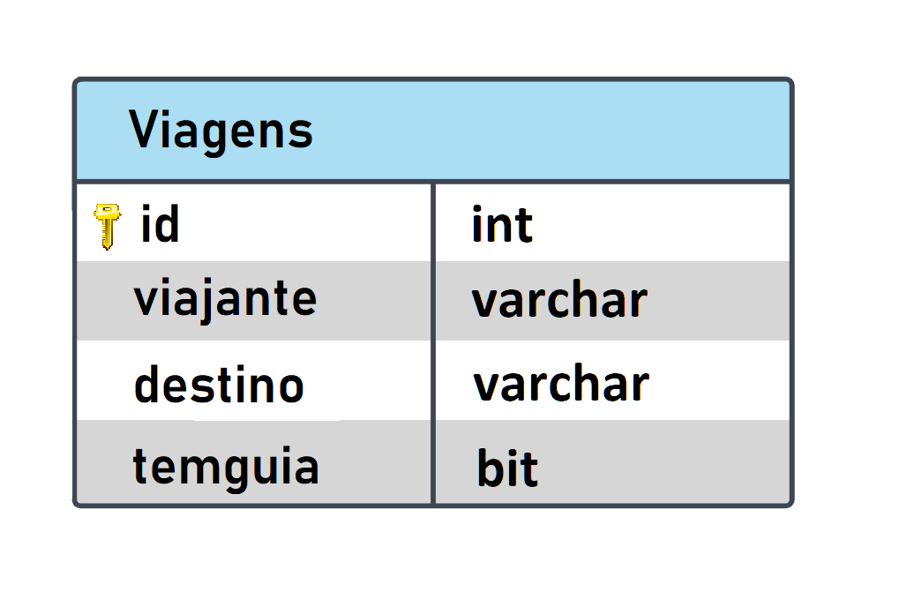

# CRUD básico em Spring Boot + React

O intuito deste projeto, não é criar uma aplicação de uso real, mas sim, praticar um pouco de Java (com Spring), através de uma API REST que faça comunicação com o React no front.
O MySQL foi utilizado como banco, assim, criando um app fullstack.

O **`modelo físico`** (script para criação do banco, minimamente populado para teste) está no diretório principal com a extensão ".sql"... 

Como não vi a necessidade de criar outras tabelas para este exemplo, a DER (**`modelo lógico`**) do banco ficou simples até de mais:

## **Tecnologias utilizadas**  

ﾠ

 

ﾠ
  
ﾠ
  
ﾠ

ﾠ

